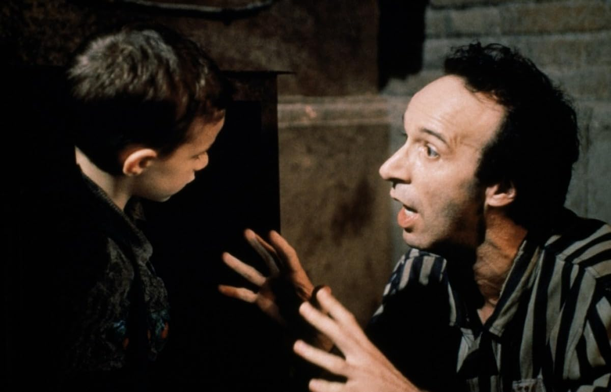

La Vita è Bella
===============

A great film from the 90s!

Service is a great art after God Himself. Pity in modern times service has come to take the meeaning of subjugation.

The immortality of the human spirit. The father goes to such great lengths.

Schopenahuer...If you want something, you just have to want it.

The fickleness of Dr Lessing, who only care about riddles and would leave his friend to die.

Anti-semitism, it is not very different from xenophobia. Guido shows just how ridiculous the whole thing is.

How I wish Guido had survived!

